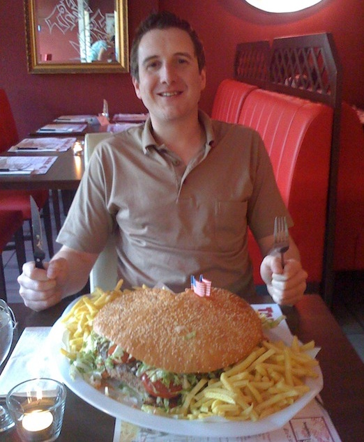
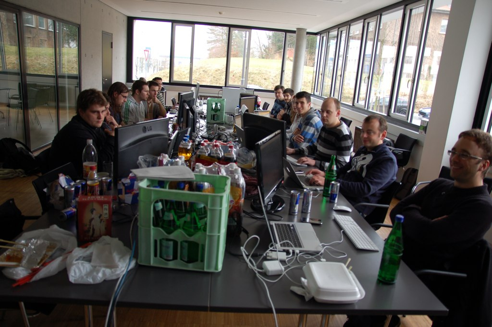

!SLIDE 
# Migrating a development company to Rails 3
## Julian Fischer
### @railshoster

!SLIDE
# About Julian Fischer

!SLIDE center transition=scrollUp

!SLIDE bullets incremental
# About Julian Fischer
* Always hungry :-)
* CEO of the Avarteq GmbH
* Head of Enterprise-Rails.de
* Owner of RailsHoster.de

!SLIDE bullets incremental
# About Julian Fischer
* Lecturing „Ruby on Rails“ @ HTWdS
* Ruby and Ruby on Rails programmer

!SLIDE
# About Avarteq GmbH

!SLIDE center transition=scrollUp

!SLIDE bullets incremental
# About Avarteq GmbH
* Development and hosting company
* Specialized on Ruby and Ruby on Rails
* ~ 18 people, mostly fulltime employees.
* Also collaborating with freelancers and other ruby companies.
